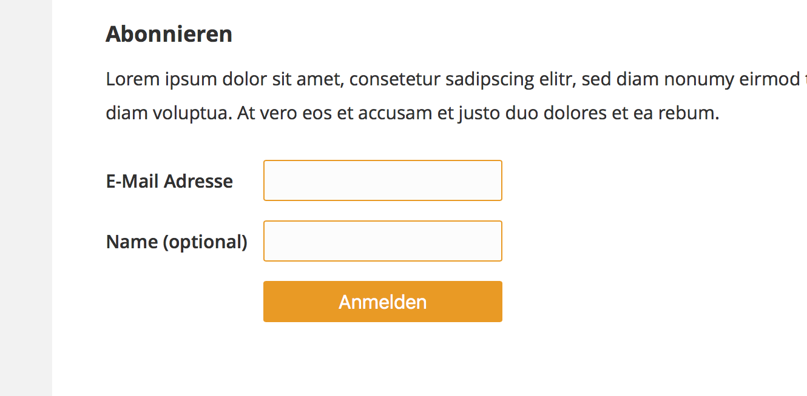

## Amani 2.0 Website
<a href="https://pad.stunkymonkey.de/p/amani_2.0">Main Etherpad</a>

### Development Environment
sass file in **styles/sass/**. Gulp workflow with minified version and debug css file included.

```
npm update
gulp
```

### Configuration

### Browser Caching
Add this to the `.htaccess`file to enable browser side caching (increases Google Page Rank):
```
# Browser Caching

FileETag MTime Size
<IfModule expires_module>
    ExpiresActive on
    ExpiresDefault "access plus 1 week"
</IfModule>
AddOutputFilterByType DEFLATE text/plain
AddOutputFilterByType DEFLATE text/html
AddOutputFilterByType DEFLATE text/xml
AddOutputFilterByType DEFLATE text/css
AddOutputFilterByType DEFLATE application/xml
AddOutputFilterByType DEFLATE application/xhtml+xml
AddOutputFilterByType DEFLATE application/rss+xml
AddOutputFilterByType DEFLATE application/javascript
AddOutputFilterByType DEFLATE application/x-javascript
AddOutputFilterByType DEFLATE image/svg+xml
```


#### Menus (no nesting - never!)
+ `mainMenu` - all links visble in the header
+ `footerMenu` - all links visible in the footer

#### Custom Post Types
+ `child` with custom fields using the ACF Plugin

#### Plugins
+ `Advanced Custom Fields` (Current version: 4.4.3)
	+ Kinder (bild, beschreibung, kinderdorf)
	+ Startseite (slideshow, news_item_count)
+ `WP Lightbox 2` (Current version: 3.0.5)

### Newsletter Form
The Plugin `newsletter_form` is used to create a form to subscribe to our mailman installation.


